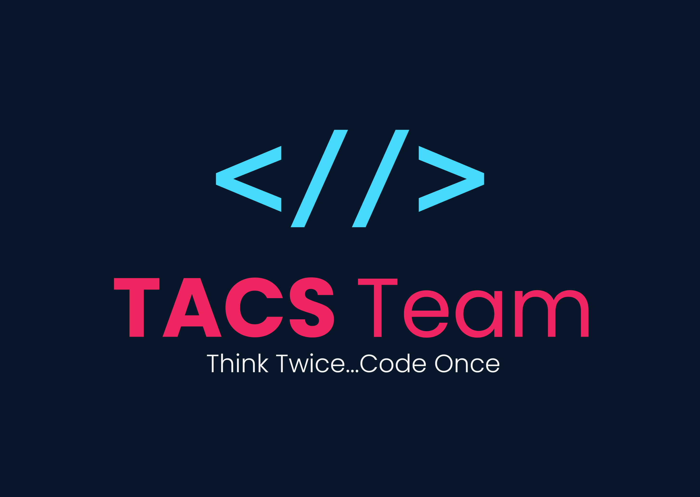
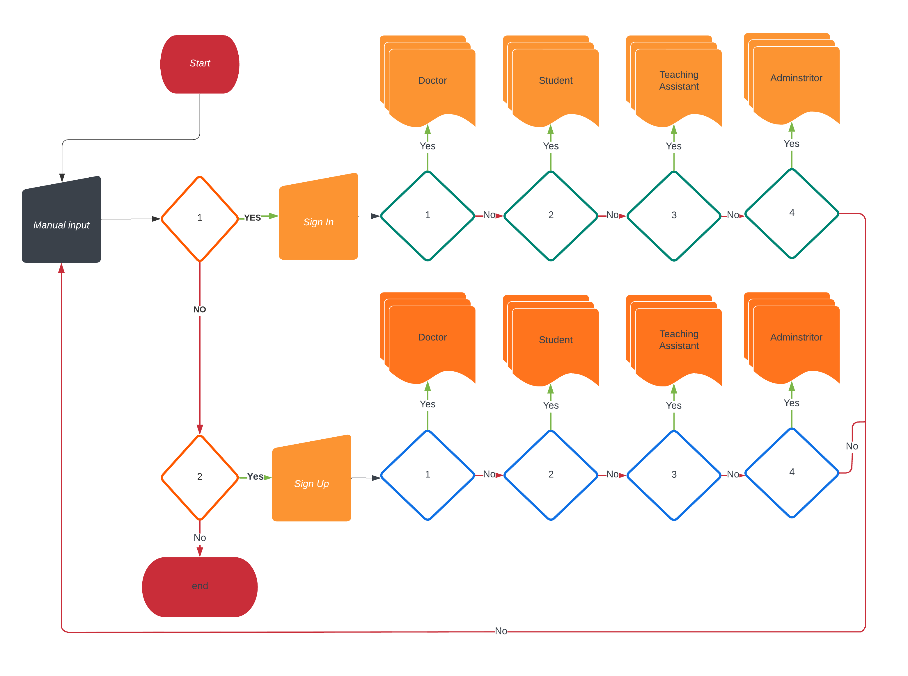
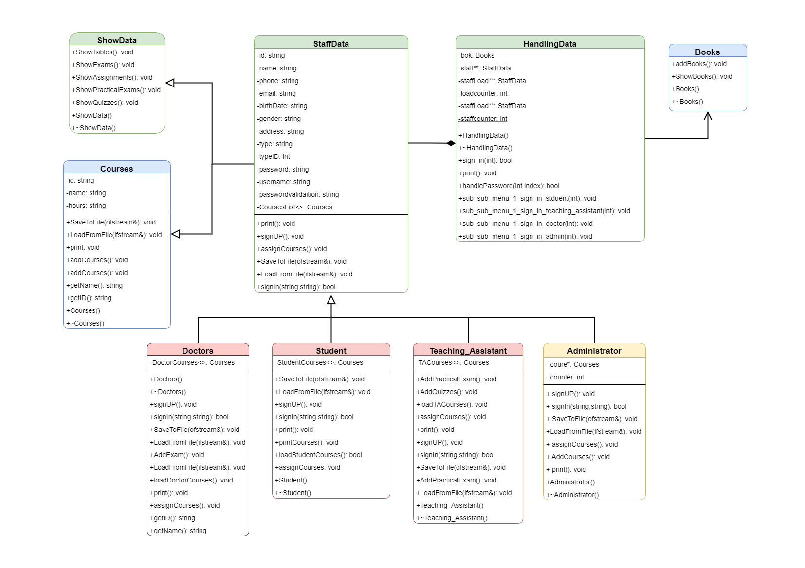

# TACS Team

# College System
College System is a basic software for managing College Data, such as Courses, Staff, Student...etc. All of these functions are handled by the system using files as a temporary database. these files are used to store and print data.

# Developers 
* [Ali Elshorpagi](https://github.com/Ali-Elshorpagi)
* [Mohamed Said](https://github.com/Mohamed03Said)
* [Amr Elbaz](https://github.com/AmrAlbaz34)
* [Ammar Gamal](https://github.com/Ammar120560)

# Demo
### Sign in
### Sign UP

# Flow Chart

# UML Diagram

